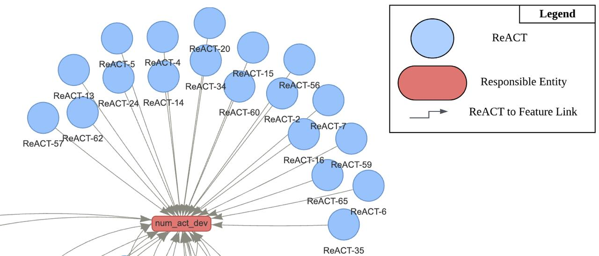

# ReACTive: Visualizing ReACTs and Their Impact on Features
This repository contains the dataset of Researched Actionables (ReACTs) and the source code for generating the network figures used in the ReACTive. Along with that, this repository includes all the necessary files to visualize the ReACT tool on the client-side/web browser. These files encompass the HTML, CSS, and JavaScript components that power the tool's front-end, ensuring a seamless and interactive user experience. 

## ReACT
Researched Actionables (ReACTs) are practical, evidence-based advice derived from a comprehensive literature review to help enhance the sustainability of Open Source Software (OSS) projects. ReACTs are designed to positively influence specific features of sustainability forecasting models, providing developers with actionable steps to improve their projects' long-term viability. By following ReACTs, OSS projects can fine-tune the features of their sustainability models, increasing their chances of success and longevity. 

## ReACTive

ReACTive is an interactive tool designed to visualize the connections between ReACTs (Researched Actionables) and features, as well as the associativity of ReACTs with entities (personnel responsible for performing ReACTs). The tool is primarily intended for developers but can also be useful for all individuals engaged in the OSS Community.

*Figure 1: A snapshot of the ReACTive network graph*

The tool displays an interactive network graph that adopts a directed acyclic graph (DAG) structure. It features circular nodes (light blue) representing ReACTs, rectangular nodes (color: light red) delineating features, and edges symbolizing articles. Edges connect ReACTs to features, indicating the existence of at least one article observing the effect. The edges are weighted, representing the strength of the relationship.

## Development of the Tool

The tool's front-end is built using HTML, CSS, and JavaScript. Python's PyVis library is used to generate the interactive network graphs, while Plotly is employed to create other interactive plots (bar chart, pie chart, scatter plot). The plots offer interactivity through tooltips that appear when users hover over or click on any component of the graph.

To preserve the interactivity of the plots, each plot is individually transformed into an HTML file and embedded into the front-end using HTML's inline element called `iframe`. This element allows for the creation of a nested browsing context, enabling the display of a distinct HTML document within the main document.

## Use Cases

### Use Case 1: Finding ReACTs to Tune Features

ReACTive can be used to find the ReACTs responsible for tuning a particular feature. Hovering over a node provides a detailed description of the node through tooltips. Hovering over an edge reveals relevant information, including article count, references, and links. Users can directly access articles from the tool that observes the relationship between a ReACT and a feature.

Clicking on a specific feature node in the graph highlights all associated ReACT nodes, offering insights into the ReACTs to consider when tuning a particular feature.

### Use Case 2: Finding Roles and Responsibilities

ReACTive can be used to understand the roles of the personnel who are responsible for performing each of the ReACTs. An interactive scatter plot is utilized to show the relationship between ReACTs and entities. The graph displays entities along the X-axis, with ReACTs represented on the Y-axis.

Interconnections between a ReACT and an entity are visually depicted as square boxes. Clicking on these boxes reveals tooltips, providing insights into the specific connection between a ReACT and an entity, including definitions for the components to offer a comprehensive understanding. With ReACTive, users can easily discern the ReACTs assigned to them, enhancing clarity and facilitating their responsibilities.

## ReACT Dataset
[This](ReACT_Dataset.xlsx) is the ReACT dataset, containing 105 ReACTs, along with the responsible entities and the impacted features.

## Getting Started
To use ReACTive, open [this](https://nafiz43.github.io/ReACTive/) in your web browser. 

However, to run the tool locally: 
1. Clone the repository: `git clone https://github.com/Nafiz43/ReACTive`
2. Open the `index.html` file in your preferred web browser.

Feel free to review the subsequent sub-sections if you wish to regenerate the networks anew.

### ReACT Network Generator
[This](ReACT_Dataset.xlsx) notebook contains all the required codes to generate the networks of the tool. 

To generate the networks, first install the dependencies by running the following command: `pip install -r requirements.txt`
Then, run all the cells of the notebook sequentially. Make sure the dataset (ReACT_Dataset.xlsx) and the notebook; are in the same directory. 

After the successful completion of all the cells, 6 HTML files will be created under the current directory. The generated files ending with "_Entity.html" are responsible for rendering -(ReACT & Entity) network diagrams, while the files ending with "_Feature.html" are responsible for rendering - (ReACT & Feature) network diagrams.

### Visualizing Networks in ReACTive
For seeing the generated HTML files in ReACTive, make sure to put the files ending with "_Entity.html" in the RE directory, while putting the files ending with "_Feature.html" in the RF directory. 

## Paper
This project is associated with the paper entitled "From Models to Practice: Enhancing OSS Project Sustainability with Evidence-Based Advice", available [here](https://doi.org/10.1145/3663529.3663777)

## Contributing

Contributions to ReACTive are welcome! If you find any issues or have suggestions for improvements, please open an issue or submit a pull request on the GitHub repository.

## License

This project is licensed under the [MIT License](LICENSE.txt).

## Contact

For any questions or inquiries, please contact:
- Nafiz Imtiaz Khan (Email: nikhan@ucdavis.edu, GitHub: [nafiz43](https://github.com/Nafiz43))

